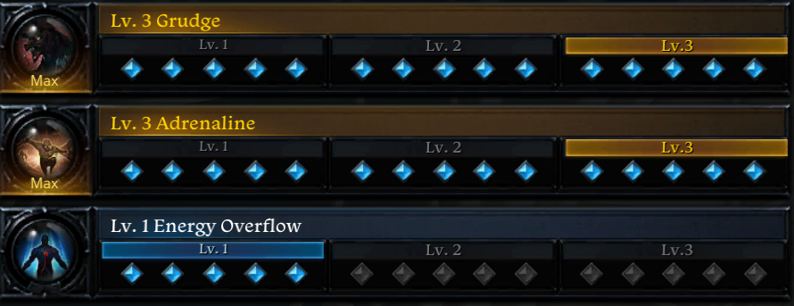
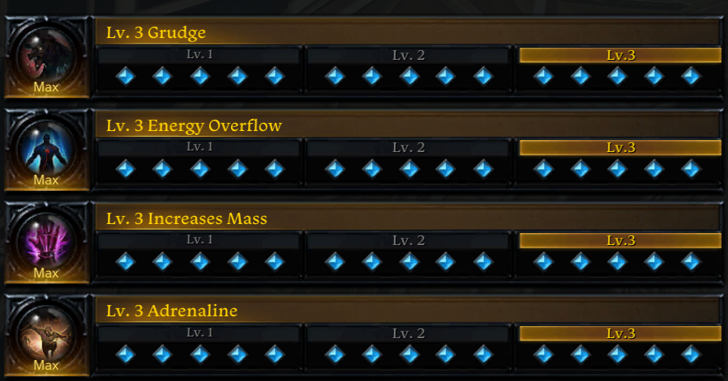
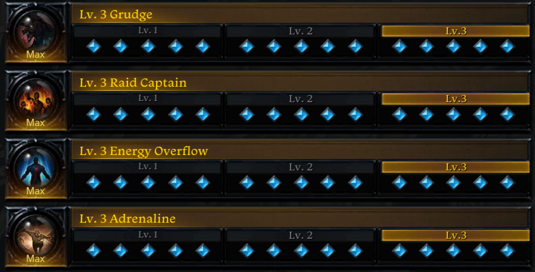
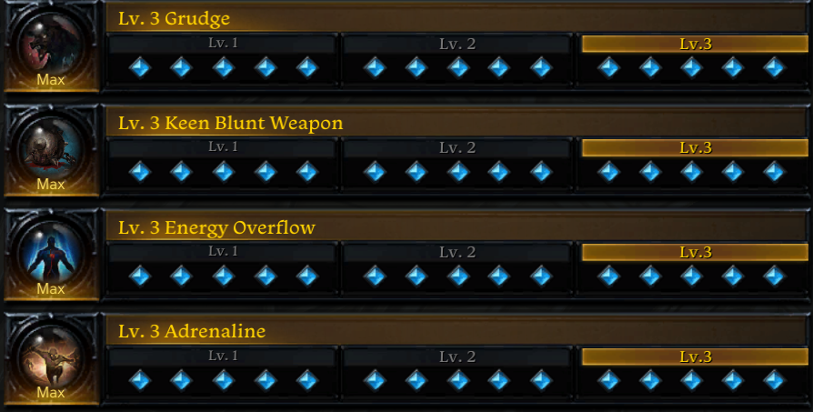
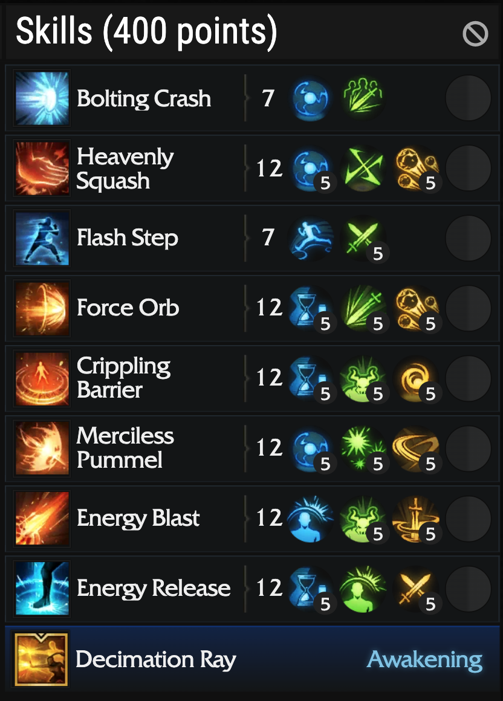
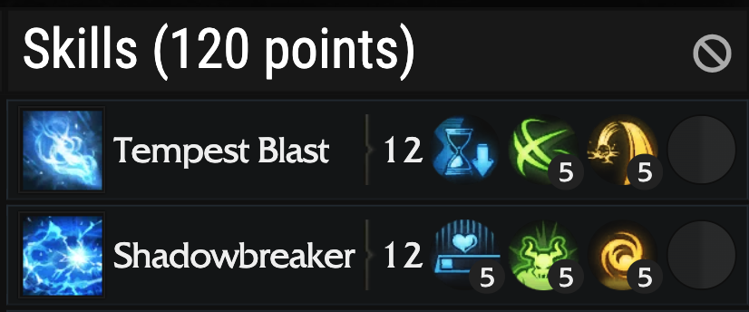
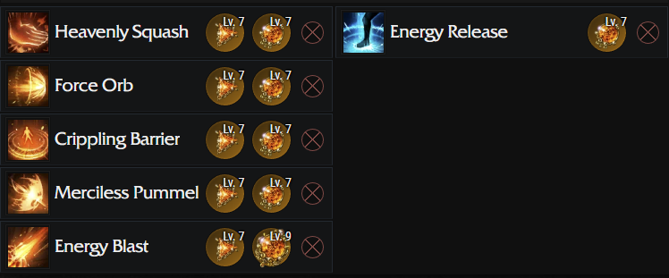
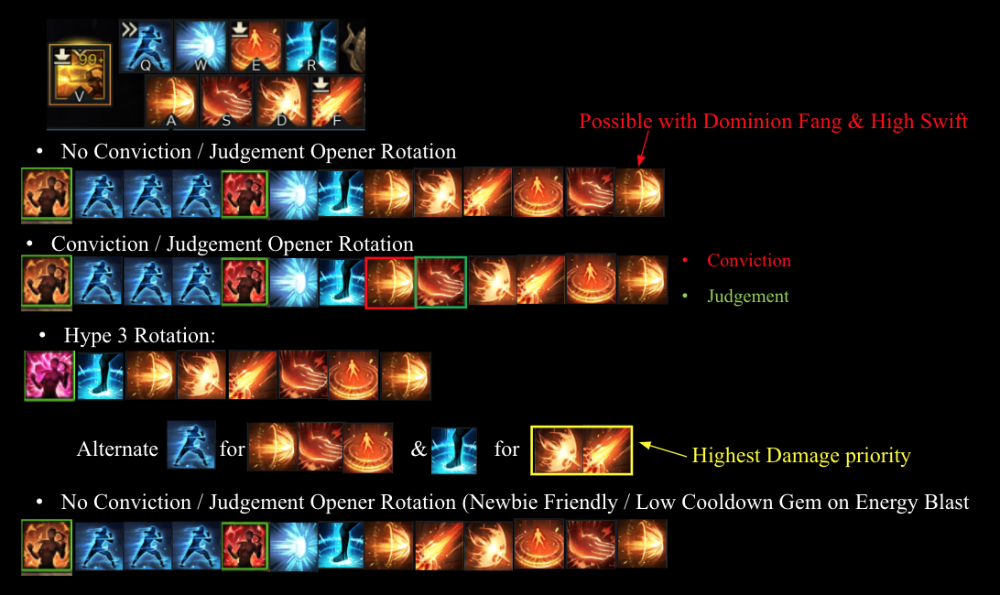

# Energy Overflow Guide

## Overview

Energy Overflow playstyle is extremely fast-paced involves dynamic rotation and proper Hype management and sometimes cooldown alignment for optimal gameplay.

Energy Overflow engraving prevents your energy from going under “1” so that you can continue smashing your skills without worrying about the energy bar.

Energy Overflow heavily focuses on SWIFTNESS as main stats that turn your character into a skill spamming machine and it is my favorite choice of class engraving.

## Engraving

### 1. Energy Overflow (Must have)
 Good

### 2. Grudge (Must have)

Only use this at Lv.3. A must have engraving for any DPS classes. This engraving will make you a better player in general.  
If you die a lot by using this engraving, just DON’T DIE & DON’T GET HIT.

>   

### 3. Adrenaline

MUST HAVE
Easy to keep up 6x stacks.
Best Crit Engraving in the game.
Highly Recommend at Lv.3, Lv.2 is fine also.

### 4. Cursed Doll / Mass Increase

  Both are interchangeable.
Increase Mass is cheaper on market while having no downside on Energy Overflow build.
I recommend using Increase Mass with higher Swiftness to have better rotation flow.

### 5. Raid Captain

 Use at Lv.3
18% Damage at 40% Movement Speed.
Can’t be fully utilized until you have high Swiftness (Relic Accessories) & Support Yearning Relic Set.
Overall, this is a solid #4 choice.

### 6. Keen Blunt Weapon

If you are in between 1370 – 1415 using Argos set, this engraving replace Raid Captain because you have high Crit.
As you transition into Relic gear with 6x Dominion Fang, you lost access to high Crit which makes this engraving less desirable since you are Crit hungry.  
Can be used as 4th choice if you have a static group with Crit Synergy classes (Gunslinger, Deadeye, Wardancer , Control Lance Master).

## Gear & Engraving Setup

### Tier 1 & Tier 2 & Early Tier 3 (1302 – 1370)

- Energy Overflow 3 & Adrenaline 3 should do the trick for throughout Tier 1 & Tier 2 content.
- Recommend: 
- - Energy Overflow + Adrenaline (Tier 1)
- - Grudge + Adrenaline + Energy Overflow (Tier 2 / Early Tier 3)

> 

### Mid Tier 3 (1370 – 1415)

- Preordained Set + Chosen Focus

> 

> 

> 

### Late Tier 3 (1415+) Relic Set

- 1415 – 1430 (Normal Valtan / Vykas)
- - Demon Beast Strength Headpiece
- - Preordained Diligence Pauldrons
- - Demon Beast Strength Chestpiece
- - Demon Beast Strength Pants
- - Preordained Diligence Gloves
- - Demon Beast Strength Focus

- 1445 - 1460 (Hard Valtan / Vykas)
- - Dominion Fang Set

### Late Tier 3 (1415+) Engraving (Relic Accessories)

- Energy Overflow Soulfist depends heavily on high Swiftness for smoother gameplay & rotation so try to go for as high-quality accessories as possible.

- When assembling the build, I recommend go for a good stone first, minimum 7/7 Ability Stone.

- Some of the engraving builds I list are just examples, always consider your region market price, accessories availability and budget, highly recommended to do market research and plan out your build ahead of time.

## Combat Abilities

### Energy Overflow Abilities Table

> 

### Abilities Tripods

> 

> 

### Gems

> 

### Abilities Layout & Rotation, Ready Attack Buff

- Since the rotation nature is dynamic base on personal Cooldown gem level, Quick Prep Tripod, you might not be able to follow the same exact rotation.

- Rule of thumb is to have Ready Attack (14.8% x 3 = 44.4% from Flash Step Tripod Lv.5 & 55.6% from Energy Release) for every abilities.

- **Ready Attack (Flash Step) & Ready Attack (Energy Release) DO NOT STACK.**

- ALWAYS look for opportunity to activate Hype 3 near the end of Hype 2 for higher damage, failing to do so will result in huge DPS loss. 

- Before going into Hype 3 near the end of Hype 2, ALWAYS make sure your ER, Pummel, and EB is up or else you are going to waste a good portion of Hype 3 duration.

> 

