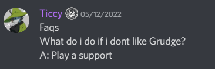
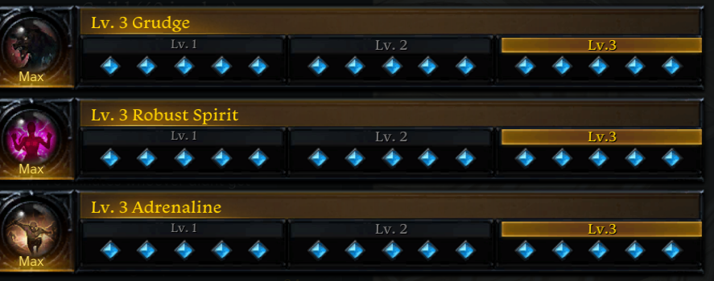
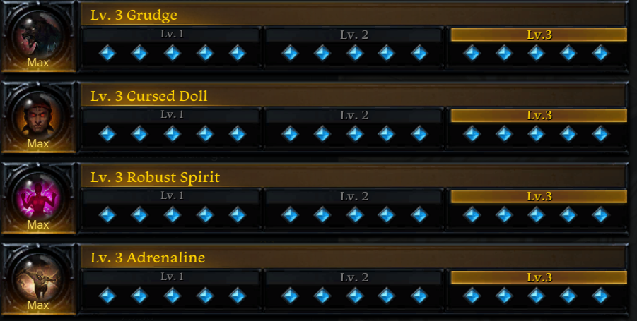
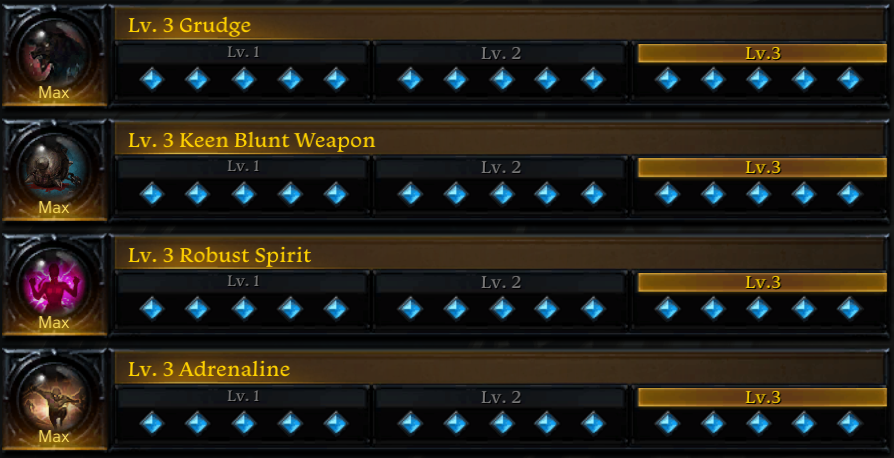
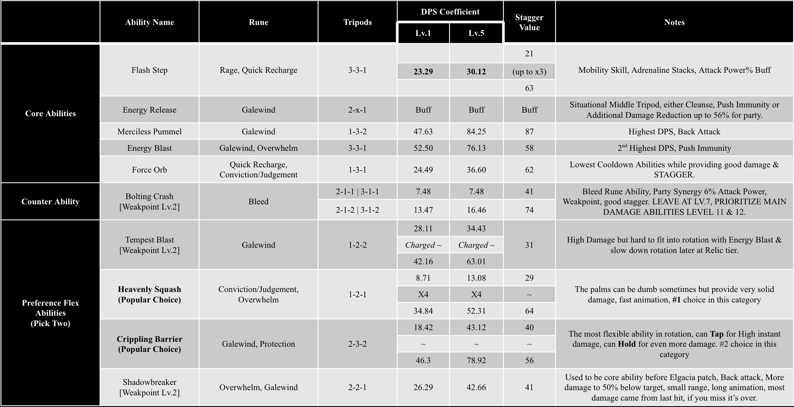
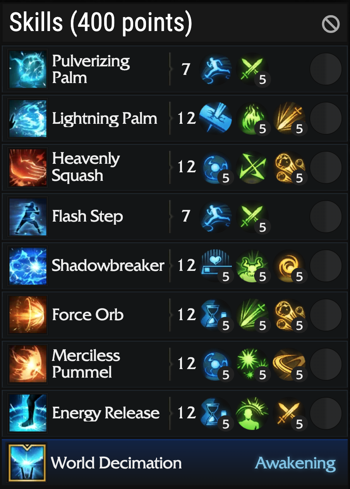
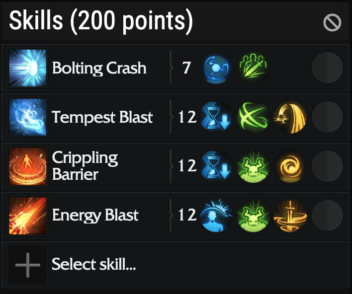
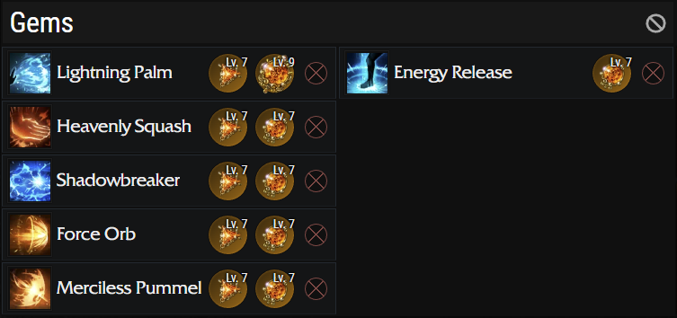
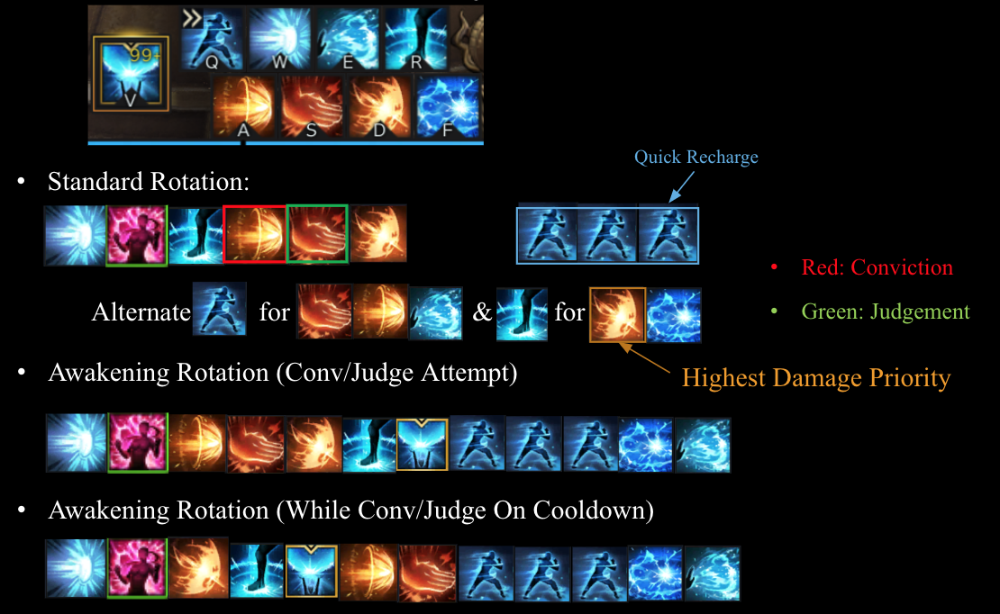

# Robust Spirit

Robust Spirit engraving allows user to skip Hype 1 & Hype 2, immediately go into Hype 3 mode.

Heavily focus on Specialization, higher Specialization means less downtime and more Hype bonuses.

As opposed to very fast-paced playstyle from Energy Overflow with complex dynamic rotation, Robust Spirit focus on slow gameplay with static cycle DPS rotation.

## Engraving

### 1. Robust Spirit

MUST HAVE at Lv.3  
Top priority

### 2. Grudge (Must have)

Only use this at Lv.3. A must have engraving for any DPS classes. This engraving will make you a better player in general.  
If you die a lot by using this engraving, just DON’T DIE & DON’T GET HIT.

> 

### 3. Adrenaline / Precise Dagger

MUST HAVE
Easy to keep up 6x stacks.
Best Crit Engraving in the game.
Highly Recommend at Lv.3, Lv.2 is fine also.  
Use Precise Dagger for cheaper/budget build and easier playtime, ONLY USE AT LV.3.

### 4. Keen Blunt Weapon

If you are in between 1370 – 1415 using Argos set, this engraving replace Cursed Doll/Mass Increase because you have high Crit.
Still as good as you transition into Relic gear with 6x Hallucination with lots of Crit.

### 5. Cursed Doll / Mass Increase

  Both are interchangeable.
Both are interchangeable.
Increase Mass has noticeable impact on performance, only use this if you have high spec (Relic Accessories), otherwise Cursed Doll is preferred.
ONLY USE AT LV.3

### 6. Awakening

Ummm... Good luck with your balls

## Gear & Engraving Setup

### Tier 1 & Tier 2 & Early Tier 3 (1302 – 1370)

- Highly recommend not to try Robust Spirit at Tier 1 / Tier 2.
- It’s decent to play at early Tier 3 and keep get getting better at late Tier 3, the following is 3 x 3 recommendation for early Tier 3.
- Adrenaline can be replaced by Precise Dagger for cheaper build and easier to play.

> 

### Mid Tier 3 (1370 – 1415)

- Preordained Set + Chosen Focus

> 

> 

> 

### Late Tier 3 (1415+) Relic Set

- 1415 – 1430 (Normal Valtan / Vykas)
- - Preordained Set

- 1445 - 1460 (Hard Valtan / Vykas)
- - Hallucination Set

### Late Tier 3 (1415+) Engraving (Relic Accessories)

- Robust Spirit Soulfist depends heavily on high Specialization for smoother gameplay & lower Hype downtime so try to go for as high-quality accessories as possible.
- When assembling the build, I recommend go for a good stone first, minimum 7/7 Ability Stone.
- Some of the engraving builds I list are just examples, always consider your region market price, accessories availability and budget, highly recommended to do market research and plan out your build ahead of time.
- Adrenaline & Cursed Doll in these build can be replaced by Precise Dagger & Increase Mass for cheaper.

## Combat Abilities

### Energy Overflow Abilities Table

> 

### Abilities Tripods

> 

> 

### Gems

> 

### Abilities Layout & Rotation, Ready Attack Buff

- Rule of thumb is to have Ready Attack (14.8% x 3 = 44.4% from Flash Step Tripod Lv.5 & 55.6% from Energy Release) for Major.

- **Ready Attack (Flash Step) & Ready Attack (Energy Release) DO NOT STACK.**

- Setup
- - Standard RS Setup Trixion: https://streamable.com/hay39g
- - Deskaluda: https://www.youtube.com/watch?v=NXjozf6AHbY
- - RS (with EO Setup) Trixion (KR): https://www.youtube.com/watch?v=waRTFw8f0Po&t=1s 

- These are very standard setup and rotation for Robust Spirit for Lv.5 – Lv.7 gems level & Under 1500 Specialization. 
- For higher Level gems & 1600 Specialization above, you can use some of the abilities listed in Energy Overflow Abilities Table
- You can replace Lightning Palm with Energy Blast or Crippling Barrier or you can use standard EO setup eventually at later patch with Bracelet.
- This is just a suggestion and yet to be tested, further testing needed to be performed to solidify the setup

> 
